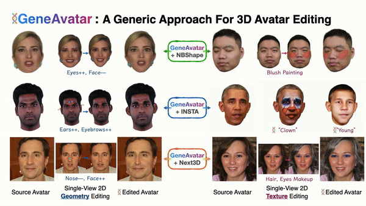

# GeneAvatar: Generic Expression-Aware Volumetric Head Avatar Editing from a Single Image

### [Project Page](https://zju3dv.github.io/geneavatar/) | [Video](https://www.youtube.com/watch?v=4zfbfPivtVU) | [Paper](https://drive.google.com/file/d/101Djfy5r66D6EeXBeafwTMKjRtInGG2k/view?usp=sharing)
<div align=center>

</div>

> [GeneAvatar: Generic Expression-Aware Volumetric Head Avatar Editing from a Single Image](https://drive.google.com/file/d/101Djfy5r66D6EeXBeafwTMKjRtInGG2k/view?usp=sharing)  
> 
> [[Chong Bao](https://chobao.github.io/), [Yinda Zhang](https://www.zhangyinda.com/)<sup>Co-Authors</sup>, [Yuan Li](https://y-u-a-n-l-i.github.io/)<sup>Co-Authors</sup>], [Xiyu Zhang](https://github.com/xyzhang77), [Bangbang Yang](https://ybbbbt.com), [Hujun Bao](http://www.cad.zju.edu.cn/home/bao/), [Marc Pollefeys](https://people.inf.ethz.ch/marc.pollefeys/), [Guofeng Zhang](http://www.cad.zju.edu.cn/home/gfzhang/), [Zhaopeng Cui](https://zhpcui.github.io/)<sup>‡</sup>. 
> 
> CVPR 2024
> 

## To-do

- [ ] Release evaluation code, pre-trained models and editing cases.
- [ ] Release training code.


## Citing
```
@inproceedings{bao2024geneavatar,
    title={GeneAvatar: Generic Expression-Aware Volumetric Head Avatar Editing from a Single Image},
    author={Bao, Chong and Zhang, Yinda and Li, Yuan and Zhang, Xiyu and Yang, Bangbang and Bao, Hujun and Pollefeys, Marc and Zhang, Guofeng and Cui, Zhaopeng},
    booktitle={The IEEE/CVF Computer Vision and Pattern Recognition Conference (CVPR)},
    year={2024}
}
```